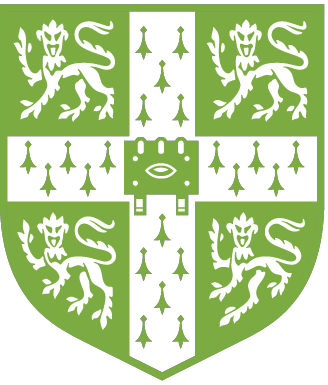

<p align="left">


</p>


 [](https://pypi.org/project/detectree2/) [](https://opensource.org/licenses/MIT) [](https://github.com/patball1/detectree2/actions/workflows/python-ci.yml) [](https://www.python.org/dev/peps/pep-0008/) [](https://doi.org/10.5281/zenodo.17367058) [](https://huggingface.co/spaces/forestmap-ai/Detectree2)


<!-- <a href="https://github.com/hhatto/autopep8"></a> -->


Python package for automatic tree crown delineation in aerial RGB and multispectral imagery based on Mask R-CNN. Pre-trained models can be picked in the [`model_garden`](https://github.com/PatBall1/detectree2/tree/master/model_garden).
Tutorials on how to prepare data, train models and make predictions are available [here](https://patball1.github.io/detectree2/tutorials/index.html). For questions, collaboration proposals and requests for data email [James Ball](mailto:ball.jgc@gmail.com). Some example data is available to download [here](https://doi.org/10.5281/zenodo.8136161).

Detectree2是一个基于Mask R-CNN的自动树冠检测与分割的Python包。您可以在[`model_garden`](https://github.com/PatBall1/detectree2/tree/master/model_garden)中选择预训练模型。[这里](https://patball1.github.io/detectree2/tutorials/index.html)提供了如何准备数据、训练模型和进行预测的教程。如果有任何问题，合作提案或者需要样例数据，可以邮件联系[James Ball](mailto:ball.jgc@gmail.com)。一些示例数据可以在[这里](https://doi.org/10.5281/zenodo.8136161)下载。

### 🌳 Want a quick taster of what detectree2 can do?

**Upload a sample of your aerial imagery and see tree crown predictions in seconds — no install, no code, no GPU required. Get a feel for the results before diving into the full package.**

<p>
<a href="https://huggingface.co/spaces/forestmap-ai/Detectree2">

</a>
</p>


| <a href="https://www.conservation.cam.ac.uk/"></a> | <sup> Code developed by James Ball, Seb Hickman, Christopher Kotthoff, Thomas Koay, Oscar Jiang, Luran Wang, Panagiotis Ioannou, James Hinton and Matthew Archer in the [Forest Ecology and Conservation Group](https://coomeslab.org/) at the University of Cambridge. The Forest Ecology and Conservation Group is led by Professor David Coomes and is part of the University of Cambridge [Conservation Research Institute](https://www.conservation.cam.ac.uk/). </sup>|
| :---: | :--- |

| <a href="https://forestmap.ai"><picture><source media="(prefers-color-scheme: dark)" srcset="./.github/forestmap_logo_dark.png"></picture></a> | <sup> Supported by [forestmap.ai](https://forestmap.ai). </sup>|
| :---: | :--- |


## Citation

Please cite this article if you use _detectree2_ in your work:

Ball, J.G.C., Hickman, S.H.M., Jackson, T.D., Koay, X.J., Hirst, J., Jay, W., Archer, M., Aubry-Kientz, M., Vincent, G. and Coomes, D.A. (2023),
Accurate delineation of individual tree crowns in tropical forests from aerial RGB imagery using Mask R-CNN.
*Remote Sens Ecol Conserv*. 9(5):641-655. [https://doi.org/10.1002/rse2.332](https://doi.org/10.1002/rse2.332)

## Independent validation

Independent validation has been performed on a temperate deciduous forest in Japan.

> *Detectree2 (F1 score: 0.57) outperformed DeepForest (F1 score: 0.52)*
>
> *Detectree2 could estimate tree crown areas accurately, highlighting its potential and robustness for tree detection and delineation*

Gan, Y., Wang, Q., and Iio, A. (2023).
Tree Crown Detection and Delineation in a Temperate Deciduous Forest from UAV RGB Imagery Using Deep Learning Approaches: Effects of Spatial Resolution and Species Characteristics. 
*Remote Sensing*. 15(3):778. [https://doi.org/10.3390/rs15030778](https://doi.org/10.3390/rs15030778)

## Requirements

- Python 3.8+
- [GDAL](https://gdal.org/download.html) geospatial libraries
- [PyTorch >= 1.8 and torchvision](https://pytorch.org/get-started/previous-versions/) (matching versions)
- [Detectron2](https://github.com/facebookresearch/detectron2) (Facebook's object detection library)
- For training models, GPU access (with CUDA) is recommended

## Installation

### Step 1: Install PyTorch

Follow the [official instructions](https://pytorch.org/get-started) to install PyTorch with the appropriate CUDA version for your system:

```bash
# Example: CPU-only
pip install torch torchvision torchaudio

# Example: CUDA 12.4
pip install torch torchvision torchaudio --index-url https://download.pytorch.org/whl/cu124
```

### Step 2: Install Detectron2

```bash
pip install 'git+https://github.com/facebookresearch/detectron2.git'
```

### Step 3: Install detectree2

```bash
pip install detectree2
```

Or install from source for development:

```bash
git clone https://github.com/PatBall1/detectree2.git
cd detectree2
pip install -e ".[dev,test]"
```

> **Note:** If you have trouble with geospatial dependencies (GDAL, rasterio, fiona), using conda to install them first is recommended: `conda install -c conda-forge gdal rasterio fiona`. See [Installation Instructions](https://patball1.github.io/detectree2/installation.html) for more details.

## Getting started

Detectree2, based on the [Detectron2](https://github.com/facebookresearch/detectron2) Mask R-CNN architecture, locates
trees in aerial images. It has been designed to delineate trees in challenging dense tropical forests for a range of
ecological applications.

This [tutorial](https://patball1.github.io/detectree2/tutorials/index.html) takes you through the key steps.
[Example Colab notebooks](https://github.com/PatBall1/detectree2/tree/master/notebooks/colab) are also available but are
not updated frequently so functions and parameters may need to be adjusted to get things working properly.

The standard workflow includes:

1) Tile the orthomosaics and crown data (for training, validation and testing)
2) Train (and tune) a model on the training tiles
3) Evaluate the model performance by predicting on the test tiles and comparing to manual crowns for the tiles
4) Using the trained model to predict the crowns over the entire region of interest

Training crowns are used to teach the network to delineate tree crowns.
<p align="center">


</p>

Here is an example image of the predictions made by Detectree2.
<p align="center">

</p>

## Applications

### Tracking tropical tree growth and mortality

<p align="center">

</p>

### Counting urban trees (Buffalo, NY)

<p align="center">

</p>

### Multi-temporal tree crown segmentation

<p align="center">

</p>

### Liana detection and infestation mapping

*In development*

<p align="center">

</p>

### Tree species identification and mapping

*In development*

## To do

- Functions for multiple labels vs single "tree" label

## Project Organization

```
├── .github/                 # CI workflows, badges and logos
│   └── workflows/
├── CODE_OF_CONDUCT.md
├── LICENSE
├── Makefile
├── README.md
├── detectree2/              # Python package (models, data loading, preprocessing, tests, etc.)
│   ├── data_loading/
│   ├── models/
│   ├── preprocessing/
│   ├── R/
│   └── tests/
├── docker/                  # Container recipe for reproducible builds
│   └── Dockerfile
├── docs/                    # Sphinx documentation sources
│   └── source/
├── model_garden/            # Pre-trained model metadata
├── notebooks/               # Exploratory, Colab, and Turing workflows
│   ├── colab/
│   ├── exploratory/
│   ├── reports/
│   └── turing/
├── report/                  # Paper figures and manuscript sections
│   ├── figures/
│   └── sections/
├── requirements/            # Runtime, test, and dev requirement files
│   ├── requirements.txt
│   ├── dev-requirements.txt
│   └── test-requirements.txt
├── pyproject.toml           # Package config, deps, tool settings
└── .setup_scripts/          # Helper scripts for local tooling
```

## Code formatting

We rely on the `pre-commit` hooks defined in `.pre-commit-config.yaml` to keep formatting, linting, and type checking consistent (yapf, isort, flake8, and mypy share the configuration in `setup.cfg`).

```bash
python -m pip install pre-commit -r requirements/dev-requirements.txt
pre-commit install
pre-commit run --all-files
```

If you need to run the tools individually you can use:

```bash
yapf -ir detectree2
isort detectree2
flake8 detectree2
mypy detectree2
```

---

Copyright (c) 2022, James G. C. Ball
