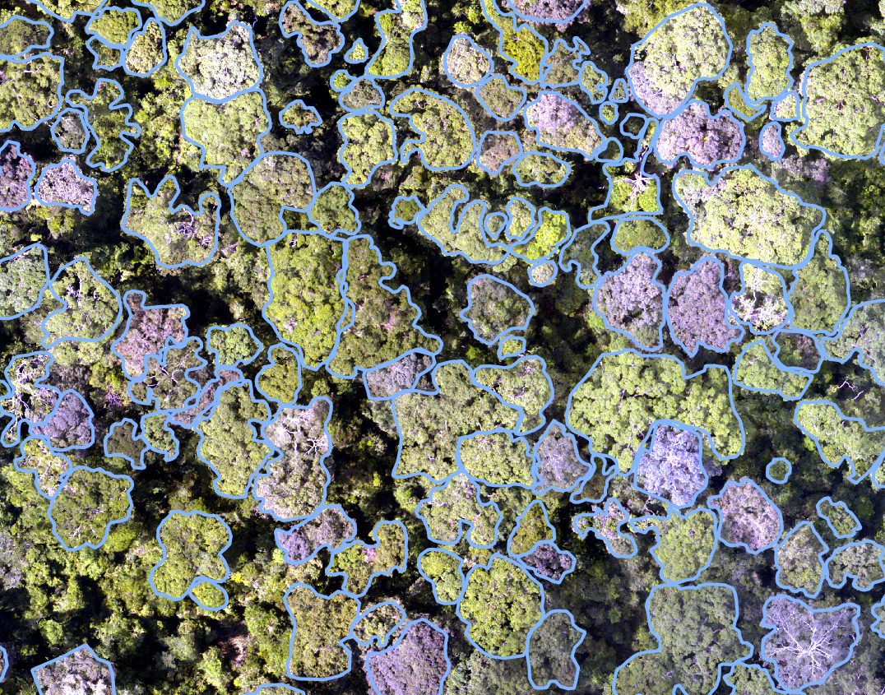
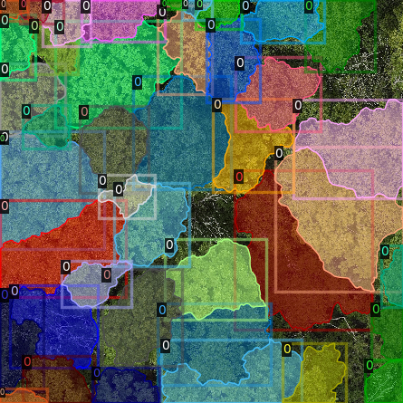
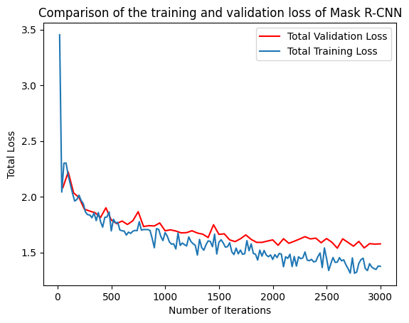
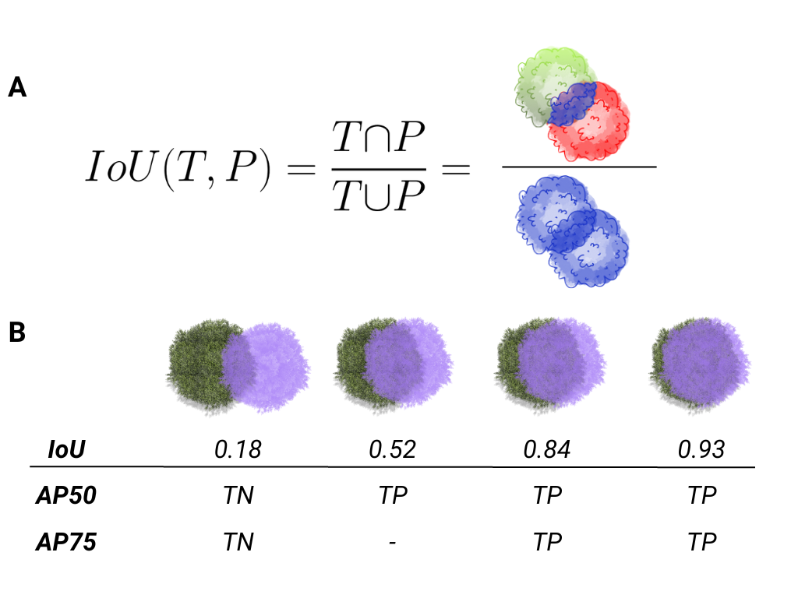

Tutorial
========

This tutorial goes through the steps of single class (tree) detection and 
delineation from RGB and multispectral data. A guide to multiclass prediction
(e.g. species mapping, disease mapping) is coming soon. Example data that can
be used in this tutorial is available
`here <https://zenodo.org/records/8136161>`_.

The key steps are:

1. Preparing data
2. Training models
3. Evaluating model performance
4. Making landscape level predictions

Before getting started ensure ``detectree2`` is installed through

.. code-block:: console

   (.venv) $pip install git+https://github.com/PatBall1/detectree2.git

To train a model you will need an orthomosaic (as ``<orthomosaic>.tif``) and 
corresponding tree crown polygons that are readable by Geopandas
(e.g. ``<crowns_polygon>.gpkg``, ``<crowns_polygon>.shp``). For the best
results, manual crowns should be supplied as dense clusters rather than
sparsely scattered across in the landscape. The method is designed to make 
predictions across the entirety of the supplied tiles and assumes training
tiles are comprehensively labelled. If the network is shown scenes that are 
incompletely labelled, it may replicate that in its predictions. See
below for an example of the required input crowns and image.

|
If you would just like to make predictions on an orthomosaic with a pre-trained
model from the ``model_garden``, skip to `part 2.8 (Generating landscape
predictions) <https://patball1.github.io/detectree2/tutorial.html#generating-landscape-predictions>`_.

The data preparation and training process for both RGB and multispectral data 
is presented here. The process is similar for both data types but there are 
some key differences that are highlighted. Training a single model on both RGB
and multispectral data at the same time is not currently supported. Stick to 
one data type per model (or stack the RGB bands with the multispectral bands
and treat as in the case of multispectral data).

Preparing data (RGB/multispectral)
--------------------------------------

An example of the recommended file structure when training a new model is as follows:

.. code-block:: bash

   ├── Danum                                       (site directory)
   │   ├── rgb
   │   │   └── Dan_2014_RGB_project_to_CHM.tif     (RGB orthomosaic in local UTM CRS)
   │   └── crowns
   │       └── Danum.gpkg                          (Crown polygons readable by geopandas e.g. Geopackage, shapefile)
   │ 
   └── Paracou                                     (site directory)
       ├── rgb                                     
       │   ├── Paracou_RGB_2016_10cm.tif           (RGB orthomosaic in local UTM CRS)
       │   └── Paracou_RGB_2019.tif                (RGB orthomosaic in local UTM CRS)
       ├── ms
       │   └── Paracou_MS_2016.tif                 (Multispectral orthomosaic in local UTM CRS)
       └── crowns
           └── UpdatedCrowns8.gpkg                 (Crown polygons readable by geopandas e.g. Geopackage, shapefile)

Here we have two sites available to train on (Danum and Paracou). Several site directories can be 
included in the training and testing phase (but only a single site directory is required).
If available, several RGB orthomosaics can be included in a single site directory (see e.g ``Paracou -> RGB``).

For Paracou, we also have a multispectral scan available (5-bands). For this data, the ``mode`` parameter in the 
``tile_data`` function should be set to ``"ms"``. This calls a different routine for tiling the data that retains the
``.tif`` format instead of converting to ``.png`` as in the case of ``rgb``. This comes at a slight expense of speed
later on but is necessary to retain all the multispectral information.

We call functions to from ``detectree2``'s tiling and training modules.

.. code-block:: python
   
   from detectree2.preprocessing.tiling import tile_data, to_traintest_folders
   from detectree2.models.train import register_train_data, MyTrainer, setup_cfg
   import rasterio
   import geopandas as gpd

Set up the paths to the orthomosaic and corresponding manual crown data.

.. code-block:: python
   
   # Set up input paths
   site_path = "/content/drive/Shareddrives/detectree2/data/Paracou"
   img_path = site_path + "/rgb/2016/Paracou_RGB_2016_10cm.tif"
   crown_path = site_path + "/crowns/220619_AllSpLabelled.gpkg"

   # Read in the tiff file (this is only necessary to deal with CRS conversion)
   # You can skip loading the data if you know crown and mosaic CRS match
   data = rasterio.open(img_path)

   # Read in crowns (then filter by an attribute if required)
   crowns = gpd.read_file(crown_path)
   crowns = crowns.to_crs(data.crs.data) # making sure CRS match

Set up the tiling parameters.

The tile size will depend on:

* The resolution of your imagery.
* Available computational resources.
* The detail required on the crown outline.
* If using a pre-trained model, the tile size used in training should roughly match the tile size of predictions.
* The ``mode`` depends on whether you are tiling 3-band RGB (``mode="rgb"``) data of multispectral data of 4 or more
bands (``mode="ms"``).

.. code-block:: python

   # Set tiling parameters
   buffer = 30
   tile_width = 40
   tile_height = 40
   threshold = 0.6
   appends = str(tile_width) + "_" + str(buffer) + "_" + str(threshold) # this helps keep file structure organised
   out_dir = site_path + "/tiles_" + appends + "/"

The total tile size here is 100 m x 100 m (a 40 m x 40 m core area with a surrounding 30 m buffer that overlaps with
surrounding tiles). Including a buffer is recommended as it allows for tiles that include more training crowns.

Next we tile the data. The ``tile_data`` function, when ``crowns`` is supplied, will only retain tiles that contain more
than the given ``threshold`` coverage of training data (here 60%). This helps to reduce the chance that the network is 
trained with tiles that contain a large number of unlabelled crowns (which would reduce its sensitivity). This value
should be adjusted depending on the density of crowns in the landscape (e.g. 10% may be more appropriate for savannah
type systems or urban environments).

.. code-block:: python
   
   tile_data(img_path, out_dir, buffer, tile_width, tile_height, crowns, threshold, mode="rgb")

.. warning::
   If tiles are outputting as blank images set ``dtype_bool = True`` in the ``tile_data`` function. This is a bug
   and we are working on fixing it. Supplying crown polygons will cause the function to tile for
   training (as opposed to landscape prediction which is described below).

.. note::
   You will want to relax the ``threshold`` value if your trees are sparsely distributed across your landscape or if you
   want to include non-forest areas (e.g. river, roads). Remember, ``detectree2`` was initially designed for dense,
   closed canopy forests so some of the default assumptions will reflect that and parameters will need to be adjusted
   for different systems.

Advanced tiling options
-----------------------

The ``tile_data`` function exposes many parameters to control how tiles are created. Here are some of the most useful ones in more detail:

- ``tile_placement``: Choose how tile origins are generated.

  - ``"grid"`` (default): Lays tiles on a fixed grid across the image bounds. Fast and predictable.
  - ``"adaptive"``: A more efficient method for training. It works by first creating a single polygon that is the union of all your training crowns, then intelligently places tiles only in rows that intersect this polygon. This avoids creating empty tiles in areas where you have no training data. Requires supplying ``crowns``; if ``crowns`` is ``None``, it falls back to ``"grid"`` with a warning.

- ``overlapping_tiles``: When ``True``, adds a second set of tiles shifted by half a tile's width and height, creating a "checkerboard" pattern. This is useful for ensuring crowns that fall on a tile boundary are fully captured in at least one tile and can help reduce prediction artifacts at tile edges.

- ``ignore_bands_indices``: Zero-based indices of bands to skip (multispectral only). These bands are ignored both when computing image statistics and when writing the output tiles. For example, to exclude band 0 and band 4 in a 5-band raster, pass ``ignore_bands_indices=[0, 4]``.

- ``nan_threshold``: The maximum proportion of a tile that can be NaN (or other no-data values) before it is discarded.

- ``use_convex_mask``: When ``True``, this creates a tight "wrapper" polygon (a convex hull) around all the training crowns within a tile. Any pixels outside this wrapper are masked out. This is a way to reduce noise by forcing the model to ignore parts of the tile that are far from any labeled object.

- ``enhance_rgb_contrast``: When ``True`` (for RGB images only), this applies a percentile contrast stretch. It calculates the 0.2 and 99.8 percentile pixel values and rescales the image to a 1-255 range. This is effective for normalizing hazy, dark, or washed-out imagery. It allows the model to more easily differentiate between tree crowns. 0 is reserved for masked-out areas.

- ``additional_nodata``: Provide a list of pixel values that should be treated as "no data". This is a data cleaning tool for real-world rasters that may have multiple invalid or uncommon values (e.g., -9999, 0, 65535) from sensor errors or previous processing steps.

- ``mask_path``: Path to a vector file (e.g., a GeoPackage) that defines your area of interest. If provided, no tiles will be created outside of this area.

- ``ignore_bands_indices``: For multispectral data, a list of zero-based band indices to exclude from the output tiles.

- ``multithreaded``: When ``True``, uses multiple CPU cores to process tiles in parallel, significantly speeding up the tiling process for large orthomosaics. Currently, this can cost a linear amount of added memory.

Practical tips:

- For training with ``crowns``, ``tile_placement="adaptive"`` can reduce I/O by avoiding empty regions while keeping
  good coverage. For full-image prediction, stick with ``"grid"``.
- When running prediction, consider ``overlapping_tiles=True`` to reduce seam artifacts; you can later post-process
  overlaps (e.g., discard detections near tile borders).

Practical Recipes and Advanced Examples
---------------------------------------

Here are some practical examples, showing how to combine parameters to solve common tasks.

**Recipe 1: Batch Tiling from Multiple Orthomosaics**
To create a larger, more diverse training dataset, you can tile data from several orthomosaics at once and combine them into a single output directory. This can be done by iterating through your data sources in Python.
.. code-block:: python
   from detectree2.preprocessing.tiling import tile_data
   import geopandas as gpd
   import rasterio
   sites = [
       {
           "img_path": "/path/to/data/SiteA/ortho.tif",
           "crown_path": "/path/to/data/SiteA/crowns.gpkg",
       },
       {
           "img_path": "/path/to/data/SiteB/ortho.tif",
           "crown_path": "/path/to/data/SiteB/crowns.gpkg",
       },
   ]
   output_dir = "/path/to/my-combined-training-data/"
   for site in sites:
       # Read crowns and ensure CRS matches the raster
       with rasterio.open(site["img_path"]) as raster:
           crowns = gpd.read_file(site["crown_path"])
           crowns = crowns.to_crs(raster.crs)
           tile_data(
               img_path=site["img_path"],
               out_dir=output_dir,
               crowns=crowns,
               tile_placement="adaptive",
               mode="ms",
               # other parameters...
               buffer=30,
               tile_width=40,
               tile_height=40,
               threshold=0.6,
           )

**Recipe 2: Tiling Noisy Multispectral Rasters**

This recipe is ideal for large, real-world multispectral datasets that may contain various "no data" artifacts.

.. code-block:: python

   from detectree2.preprocessing.tiling import tile_data
   import geopandas as gpd
   import rasterio

   img_path = "/path/to/your/large_ms_ortho.tif"
   crown_path = "/path/to/your/crowns.gpkg"
   output_dir = "/path/to/ms_tiles"

   # Read crowns and ensure CRS matches the raster
   with rasterio.open(img_path) as raster:
       crowns = gpd.read_file(crown_path)
       crowns = crowns.to_crs(raster.crs)

       tile_data(
           img_path=img_path,
           out_dir=output_dir,
           crowns=crowns,
           mode="ms",
           tile_placement="adaptive",
           additional_nodata=[-10000, -20000],
           tile_width=80,
           buffer=10,
           # other parameters...
           tile_height=80,
           threshold=0.6,
       )

What this does:
  - ``mode="ms"``: Activates the multispectral workflow.
  - ``tile_placement="adaptive"``: Saves time and disk space by only creating tiles where crown data exists.
  - ``additional_nodata=[-10000, -20000]``: Cleans the data by masking out multiple different invalid pixel values.
  - ``tile_width=80, buffer=10``: The tile size and buffer are customized to match the data's scale.

Converting Multispectral Tiles to RGB
-------------------------------------

If you have multispectral (MS) tiles but want to use them with an RGB-trained model or simply visualize them easily, you can use the ``create_RGB_from_MS`` utility. This function converts a folder of MS tiles into a new folder of 3-band RGB tiles.

.. note::
  This utility is very powerful. It not only converts the images but also copies all ``.geojson`` annotation files and the ``train/test`` folder structure, automatically updating the image paths inside the ``.geojson`` files to point to the new RGB ``.png`` files.

The function offers two conversion methods:
- ``conversion="pca"``: Performs a Principal Component Analysis to find the 3 most important components and maps them to R, G, and B. This is great for visualization.
- ``conversion="first-three"``: Simply takes the first three bands of the MS image.

Here is how you would use it in Python:

.. code-block:: python

    from detectree2.preprocessing.tiling import create_RGB_from_MS

    # Path to the folder containing your multispectral .tif tiles
    ms_tile_folder = "/path/to/ms_tiles/"

    # Path for the new RGB tiles
    rgb_output_folder = "/path/to/rgb_tiles_from_ms/"

    # Convert the tiles using PCA
    create_RGB_from_MS(
        tile_folder_path=ms_tile_folder,
        out_dir=rgb_output_folder,
        conversion="pca"
    )

Send geojsons to train folder (with sub-folders for k-fold cross validation) and a test folder.

.. code-block:: python
   
   data_folder = out_dir # data_folder is the folder where the .png, .tif, .geojson tiles have been stored
   to_traintest_folders(data_folder, out_dir, test_frac=0.15, strict=False, folds=5)

.. note::
   If ``strict=True``, the ``to_traintest_folders`` function will automatically remove training/validation geojsons
   that have any overlap with test tiles (including the buffers), ensuring strict spatial separation of the test data.
   However, this can remove a significant proportion of the data available to train on. If validation accuracy is a 
   sufficient test of model performance, you can either not create a test set (``test_frac=0``) or allow for 
   overlap in the buffers between test and train/val tiles (``strict=False``).

The data has now been tiled and partitioned for model training, tuning and evaluation.

.. code-block::
   
   └── Danum                                       (site directory)
       ├── rgb
       │   └── Dan_2014_RGB_project_to_CHM.tif     (RGB orthomosaic in local UTM CRS)
       ├── crowns
       │   └── Danum.gpkg
       └── tiles                                   (tile directory)
           ├── train
           │   ├── fold_1                          (train/val fold folder)
           │   ├── fold_2                          (train/val fold folder)
           │   └── ...
           └── test                                (test data folder)
 

It is recommended to visually inspect the tiles before training to ensure that the tiling has worked as expected and
that crowns and images align. This can be done with the inbuilt ``detectron2`` visualisation tools. For RGB tiles
(``.png``), the following code can be used to visualise the training data.

.. code-block:: python
   
   from detectron2.data import DatasetCatalog, MetadataCatalog
   from detectron2.utils.visualizer import Visualizer
   from detectree2.models.train import combine_dicts, register_train_data
   import random
   import cv2
   from PIL import Image

   name = "Danum"
   train_location = "/content/drive/Shareddrives/detectree2/data/" + name + "/tiles_" + appends + "/train"
   dataset_dicts = combine_dicts(train_location, 1) # The number gives the fold to visualise
   trees_metadata = MetadataCatalog.get(name + "_train")

   for d in dataset_dicts:
      img = cv2.imread(d["file_name"])
      visualizer = Visualizer(img[:, :, ::-1], metadata=trees_metadata, scale=0.3)
      out = visualizer.draw_dataset_dict(d)
      image = cv2.cvtColor(out.get_image()[:, :, ::-1], cv2.COLOR_BGR2RGB)
      display(Image.fromarray(image))

|
.. image:: ../../report/figures/trees_train2.png
   :width: 400
   :alt: Training tile 2
   :align: center

|
Alternatively, with some adaptation the ``detectron2`` visualisation tools can also be used to visualise the
multispectral (``.tif``) tiles.

.. code-block:: python
   
   import rasterio
   from detectron2.utils.visualizer import Visualizer
   from detectree2.models.train import combine_dicts
   from detectron2.data import DatasetCatalog, MetadataCatalog
   from PIL import Image
   import numpy as np
   import cv2
   import matplotlib.pyplot as plt
   from IPython.display import display

   val_fold = 1
   name = "Paracou"
   tiles = "/tilesMS_" + appends + "/train"
   train_location = "/content/drive/MyDrive/WORK/detectree2/data/" + name + tiles
   dataset_dicts = combine_dicts(train_location, val_fold)
   trees_metadata = MetadataCatalog.get(name + "_train")

   # Function to normalize and convert multi-band image to RGB if needed
   def prepare_image_for_visualization(image):
      if image.shape[2] == 3:
         # If the image has 3 bands, assume it's RGB
         image = np.stack([
               cv2.normalize(image[:, :, i], None, 0, 255, cv2.NORM_MINMAX)
               for i in range(3)
         ], axis=-1).astype(np.uint8)
      else:
         # If the image has more than 3 bands, choose the first 3 for visualization
         image = image[:, :, :3]  # Or select specific bands
         image = np.stack([
               cv2.normalize(image[:, :, i], None, 0, 255, cv2.NORM_MINMAX)
               for i in range(3)
         ], axis=-1).astype(np.uint8)

      return image

   # Visualize each image in the dataset
   for d in dataset_dicts:
      with rasterio.open(d["file_name"]) as src:
         img = src.read()  # Read all bands
         img = np.transpose(img, (1, 2, 0))  # Convert to HWC format
         img = prepare_image_for_visualization(img)  # Normalize and prepare for visualization

      visualizer = Visualizer(img[:, :, ::-1]*10, metadata=trees_metadata, scale=0.5)
      out = visualizer.draw_dataset_dict(d)
      image = out.get_image()[:, :, ::-1]
      display(Image.fromarray(image))

Training (RGB)
----------------------

Before training can commence, it is necessary to register the training data. It is possible to set a validation fold for
model evaluation (which can be helpful for tuning models). The validation fold can be changed over different training 
steps to expose the model to the full range of available training data. Register as many different folders as necessary

.. code-block:: python
   
   train_location = "/content/drive/Shareddrives/detectree2/data/Danum/tiles_" + appends + "/train/"
   register_train_data(train_location, 'Danum', val_fold=5)

   train_location = "/content/drive/Shareddrives/detectree2/data/Paracou/tiles_" + appends + "/train/"
   register_train_data(train_location, "Paracou", val_fold=5) 

The data will be registered as ``<name>_train`` and ``<name>_val`` (or ``Paracou_train`` and ``Paracou_val`` in the
above example). It will be necessary to supply these registration names below...

We must supply a ``base_model`` from Detectron2's  ``model_zoo``. This loads a backbone that has been pre-trained which
saves us the pain of training a model from scratch. We are effectively transferring this model and (re)training it on
our problem for the sake of time and efficiency. The ``trains`` and ``tests`` variables containing the registered
datasets should be tuples containing strings. If just a single site is being used a comma should still be supplied (e.g. 
``trains = ("Paracou_train",)``) otherwise the data loader will malfunction.

.. note::
   The ``tile_data`` function offers several parameters like ``tile_placement`` ("grid" or "adaptive"),
   ``overlapping_tiles``, and ``ignore_bands_indices`` to control the tiling process.
   While the defaults match previous behavior, you can use these to fine-tune tile generation.

.. code-block:: python
   
   # Set the base (pre-trained) model from the detectron2 model_zoo
   base_model = "COCO-InstanceSegmentation/mask_rcnn_R_101_FPN_3x.yaml"
      
   trains = ("Paracou_train", "Danum_train", "SepilokEast_train", "SepilokWest_train") # Registered train data
   tests = ("Paracou_val", "Danum_val", "SepilokEast_val", "SepilokWest_val") # Registered validation data
   
   out_dir = "/content/drive/Shareddrives/detectree2/240809_train_outputs"
   
   cfg = setup_cfg(base_model, trains, tests, workers=4, eval_period=100, max_iter=3000, out_dir=out_dir, resize="random") # update_model arg can be used to load in trained  model

Alternatively, it is possible to train from one of ``detectree2``'s pre-trained models. This is normally recommended and
especially useful if you only have limited training data available. To retrieve the model from the repo's
``model_garden`` run e.g.:

.. code-block:: python

   !wget https://zenodo.org/records/15863800/files/250312_flexi.pth

Then set up the configurations as before but with the trained model also supplied:

.. code-block:: python

   # Set the base (pre-trained) model from the detectron2 model_zoo
   base_model = "COCO-InstanceSegmentation/mask_rcnn_R_101_FPN_3x.yaml"

   # Set the updated model weights from the detectree2 pre-trained model
   trained_model = "./230103_randresize_full.pth"
      
   trains = ("Paracou_train", "Danum_train", "SepilokEast_train", "SepilokWest_train") # Registered train data
   tests = ("Paracou_val", "Danum_val", "SepilokEast_val", "SepilokWest_val") # Registered validation data
   
   out_dir = "/content/drive/Shareddrives/detectree2/240809_train_outputs"
   
   cfg = setup_cfg(base_model, trains, tests, trained_model, workers = 4, eval_period=100, max_iter=3000, out_dir=out_dir) # update_model arg used to load in trained model

.. note::

   You may want to experiment with how you set up the ``cfg``. The variables can make a big difference to how quickly 
   model training will converge given the particularities of the data supplied and computational resources available.

Once we are all set up, we can get commence model training. Training will continue until a specified number of
iterations (``max_iter``) or until model performance is no longer improving ("early stopping" via ``patience``). The
``patience`` parameter sets the number of training epochs to wait for an improvement in validation accuracy before
stopping training. This is useful for preventing overfitting and saving time. Each time an improved model is found it is
saved to the output directory.

Training outputs, including model weights and training metrics, will be stored in ``out_dir``.

.. code-block::

   trainer = MyTrainer(cfg, patience = 5) 
   trainer.resume_or_load(resume=False)
   trainer.train()

.. note::

   Early stopping is implemented and will be triggered by a sustained failure to improve on the performance of
   predictions on the validation fold. This is measured as the AP50 score of the validation predictions.

Training (multispectral)
--------------------------------

The process for training a multispectral model is similar to that for RGB data but there are some key steps that are
different. Data will be read from ``.tif`` files of 4 or more bands instead of the 3-band ``.png`` files.

Data should be registered as before:

.. code-block:: python

   from detectree2.models.train import register_train_data, remove_registered_data
   val_fold = 5
   appends = "40_30_0.6"
   site_path = "/content/drive/SharedDrive/detectree2/data/Paracou"
   train_location = site_path + "/tilesMS_" + appends + "/train/"
   register_train_data(train_location, "ParacouMS", val_fold)

The number of bands can be checked with rasterio:

.. code-block:: python

   import rasterio
   import os
   import glob

   # Read in geotif and assess mean and sd for each band
   #site_path = "/content/drive/MyDrive/WORK/detectree2/data/Paracou"
   folder_path = site_path + "/tilesMS_" + appends + "/"

   # Select path of first .tif file
   img_paths = glob.glob(folder_path + "*.tif")
   img_path = img_paths[0]

   # Open the raster file
   with rasterio.open(img_path) as dataset:
      # Get the number of bands
      num_bands = dataset.count

   # Print the number of bands
   print(f'The raster has {num_bands} bands.')

Due to the additional bands, the weights of the first convolutional layer (conv1) are modified to accommodate a
variable number of input channels. This is automatically done in the case of ``imgmode`` being set to ``"ms"``
and the ``update_model``'s input channels not matching the current model's.
The first three input weights are repeated across the new bands. The extension of the ``cfg.MODEL.PIXEL_MEAN``
and ``cfg.MODEL.PIXEL_STD`` lists to include the additional bands happens within the ``setup_cfg`` function when
``num_bands`` is set to a value greater than 3. ``imgmode`` should be set to ``"ms"`` to ensure the correct
training routines are called.

.. code-block:: python

   from datetime import date
   import torch.nn as nn
   import torch.nn.init as init
   from detectron2.modeling.roi_heads.fast_rcnn import FastRCNNOutputLayers
   import numpy as np
   from detectree2.models.train import MyTrainer, setup_cfg

   # Good idea to keep track of the date if producing multiple models
   today = date.today()
   today = today.strftime("%y%m%d")

   names = ["ParacouMS",]

   trains = (names[0] + "_train",)
   tests = (names[0] + "_val",)
   out_dir = "/content/drive/SharedDrive/detectree2/models/" + today + "_ParacouMS"

   base_model = "COCO-InstanceSegmentation/mask_rcnn_R_101_FPN_3x.yaml"  # Path to the model config

   # Set up the configuration
   cfg = setup_cfg(base_model, trains, tests, workers = 2, eval_period=50,
                  base_lr = 0.0003, backbone_freeze=0, gamma = 0.9,
                  max_iter=500000, out_dir=out_dir, resize = "rand_fixed", imgmode="ms",
                  num_bands= num_bands) # update_model arg can be used to load in trained  model

With additional bands, more data is being passed through the network per image so it may be neessary to reduce the 
number of images per batch. Only do this is you a getting warnings/errors about memory usage (e.g.
``CUDA out of memory``) as it will slow down training.

.. code-block:: python

   cfg.SOLVER.IMS_PER_BATCH = 1

   trainer = MyTrainer(cfg, patience = 5) 
   trainer.resume_or_load(resume=False)
   trainer.train()

Advanced Multispectral Options
~~~~~~~~~~~~~~~~~~~~~~~~~~~~~~

For developers looking to experiment further with multispectral data, here are some advanced techniques.

Pro Tip: Selective Band Usage
*****************************

You may want to experiment with tiling the full spectral image but only using a subset of your available spectral bands without creating new image files. You would do this to quickly test which bands are most informative for your task, without having to retile all combinations, which takes time, resources, and storage.
This can be achieved by creating a custom data mapper that reads only specific bands from your `.tif` files.

First, define a list of the 1-based band indices you wish to use. Then, define a custom `FlexibleDatasetMapper` that incorporates this logic, and pass it to the training loader.

.. code-block:: python

   import detectree2.models.train as t
   import detectron2.data.transforms as T
   import rasterio
   import torch
   import numpy as np

   # Define which bands to read (1-based indices)
   only_read_bands = [4, 5, 6, 7]
   
   # You must update num_bands in the cfg to match the number of selected bands
   cfg.INPUT.NUM_IN_CHANNELS = len(only_read_bands)
   
   # Create a custom mapper class to read only specific bands
   class CustomBandMapper(t.FlexibleDatasetMapper):
       def __call__(self, dataset_dict):
           try:
               with rasterio.open(dataset_dict["file_name"]) as src:
                   # Read only the specified bands
                   img = src.read(indexes=only_read_bands)
               
               # Transpose to (H, W, C)
               img = np.transpose(img, (1, 2, 0)).astype("float32")

               aug_input = T.AugInput(img)
               transforms = self.augmentations(aug_input)
               img = aug_input.image
               dataset_dict["image"] = torch.as_tensor(np.ascontiguousarray(img.transpose(2, 0, 1)))

               # ... Potentially here the rest that is also in FlexibleDatasetMapper

               if "annotations" in dataset_dict:
                   self._transform_annotations(dataset_dict, transforms, img.shape[:2])
               
               return dataset_dict
           except Exception as e:
               print(f"Error processing {dataset_dict.get('file_name', 'unknown')}: {e}")
               return None

   # Override the default train loader with one that uses the custom mapper
   t.FlexibleDatasetMapper = CustomBandMapper

   # After this, you can proceed with other steps as usual and then call t.MyTrainer(cfg)
   # Now, when you run trainer.train(), it will use only the bands specified.

Pro Tip: Advanced Weight Initialization
~~~~~~~~~~~~~~~~~~~~~~~~~~~~~~~~~~~~~~~

The default method for adapting a 3-channel (RGB) pre-trained model to more input channels is to repeat the weights of the first three channels. The `detectree2` library provides a utility function to perform this weight adaptation.

For developers who need to adapt an existing model to a different number of input bands (e.g., for 4-band imagery), the `multiply_conv1_weights` function located in `detectree2.models.train` automatically copies weights of an existing model round-robin style. Without the call to this method, the model's weights would be initialized randomly across the whole input convolution layer.

Data augmentation
-----------------

Data augmentation is a technique used to artificially increase the size of the training dataset by applying random
transformations to the input data. This can help improve the generalization of the model and reduce overfitting. The
``detectron2`` library provides a range of data augmentation options that can be used during training. These include
random flipping, scaling, rotation, and color jittering.

Additionally, resizing of the input data can be applied as an augmentation technique. This can be useful when training
a model that should be flexible with respect to tile size and resolution.

By default, random rotations and flips will be performed on input images.

.. code-block:: python

   augmentations = [
      T.RandomRotation(angle=[0, 360], expand=False),
      T.RandomFlip(prob=0.5, horizontal=True, vertical=False),
   ]

If the input data is RGB, additional augmentations will be applied to adjust the brightness, contrast, saturation, and
lighting of the images. These augmentations are only available for RGB images and will not be applied to multispectral.

.. code-block:: python

   # Additional augmentations for RGB images
   if cfg.IMGMODE == "rgb":
      augmentations.extend([
            T.RandomBrightness(0.7, 1.5),
            T.RandomLighting(0.7),
            T.RandomContrast(0.6, 1.3),
            T.RandomSaturation(0.8, 1.4)
      ])

There are three resizing modes for the input data (1) ``fixed``, (2) ``random``, and (3) ``rand_fixed``. This are set
in the configuration file (``cfg``) with the `setup_cfg` function.

The ``fixed`` mode will resize the input data to a images width/height of 1000 pixels. This is efficient but may not
lead to models that transfer well across scales (e.g. if the model is to be used on a range of different resolutions).

.. code-block:: python

   if cfg.RESIZE == "fixed":
      augmentations.append(T.ResizeShortestEdge([1000, 1000], 1333))

The ``random`` mode will randomly resize (and resample to change the resolutions) the input data to between 0.6 and 1.4
times the original height/width. This can help the model learn to detect objects at different scales and from images of
different resolutions (and sensors).

.. code-block:: python

   elif cfg.RESIZE == "random":
      size = None
      for i, datas in enumerate(DatasetCatalog.get(cfg.DATASETS.TRAIN[0])):
            location = datas['file_name']
            try:
               # Try to read with cv2 (for RGB images)
               img = cv2.imread(location)
               if img is not None:
                  size = img.shape[0]
               else:
                  # Fall back to rasterio for multi-band images
                  with rasterio.open(location) as src:
                        size = src.height  # Assuming square images
            except Exception as e:
               # Handle any errors that occur during loading
               print(f"Error loading image {location}: {e}")
               continue
            break
      
      if size:
            print("ADD RANDOM RESIZE WITH SIZE = ", size)
            augmentations.append(T.ResizeScale(0.6, 1.4, size, size))

The ``rand_fixed`` mode constrains the random resizing to a fixed pixel width/height range (regardless of the resolution
of the input data). This can help to speed up training if the input tiles are high resolution and pushing up against
available memory limits. It retains the benefits of random resizing but constrains the range of possible sizes.

.. code-block:: python

   elif cfg.RESIZE == "rand_fixed":
         augmentations.append(T.ResizeScale(0.6, 1.4, 1000, 1000))

Which resizing option is selected depends on the problem at hand. A more precise delineation can be generated if high
resolution images are retained but this comes at the cost of increased memory usage and slower training times. If the
model is to be used on a range of different resolutions, random resizing can help the model learn to detect objects at
different scales.

Post-training (check convergence)
------------------------------------------

It is important to check that the model has converged and is not overfitting. This can be done by plotting the training
and validation loss over time. The ``detectron2`` training routine will output a ``metrics.json`` file that can be used
to plot the training and validation loss. The following code can be used to plot the loss:

.. code-block:: python

   import json
   import matplotlib.pyplot as plt
   from detectree2.models.train import load_json_arr

   #out_dir = "/content/drive/Shareddrives/detectree2/models/230103_resize_full"
   experiment_folder = out_dir

   experiment_metrics = load_json_arr(experiment_folder + '/metrics.json')

   plt.plot(
      [x['iteration'] for x in experiment_metrics if 'validation_loss' in x],
      [x['validation_loss'] for x in experiment_metrics if 'validation_loss' in x], label='Total Validation Loss', color='red')
   plt.plot(
      [x['iteration'] for x in experiment_metrics if 'total_loss' in x],
      [x['total_loss'] for x in experiment_metrics if 'total_loss' in x], label='Total Training Loss')

   plt.legend(loc='upper right')
   plt.title('Comparison of the training and validation loss of detectree2')
   plt.ylabel('Total Loss')
   plt.xlabel('Number of Iterations')
   plt.show()

|
Training loss and validation loss decreased over time. As training continued, the validation loss flattened whereas the
training loss continued to decrease. The ``patience`` mechanism prevented training from continuing after 3000 iterations
preventing overfitting. If validation loss is substantially higher than training loss, the model may be overfitted.

To understand how the segmentation performance improves through training, it is also possible to plot the AP50 score
(see below for definition) over the iterations. This can be done with the following code:

.. code-block:: python

   plt.plot(
      [x['iteration'] for x in experiment_metrics if 'validation_loss' in x],
      [x['validation_loss'] for x in experiment_metrics if 'validation_loss' in x], label='Total Validation Loss', color='red')
   plt.plot(
      [x['iteration'] for x in experiment_metrics if 'total_loss' in x],
      [x['total_loss'] for x in experiment_metrics if 'total_loss' in x], label='Total Training Loss')

   plt.legend(loc='upper right')
   plt.title('Comparison of the training and validation loss of detectree2')
   plt.ylabel('Total Loss')
   plt.xlabel('Number of Iterations')
   plt.show()

.. image:: ../../report/figures/val_AP50.png
   :width: 400
   :alt: AP50 score
   :align: center
|

Pro Tip: Advanced Fine-grained Layer Freezing
~~~~~~~~~~~~~~~~~~~~~~~~~~~~~~~~~~~~~~~~~~~~~~

When you load a pre-trained model, you are benefiting from features learned on a very large dataset. However, you may not want to retrain the entire network, especially if your own dataset is small, as this can lead to overfitting. A powerful technique is to "freeze" parts of the network, making their weights non-trainable, and only fine-tune the higher-level layers. Here’s how you can apply this technique after creating the `trainer` object and before calling `trainer.train()`:

.. code-block:: python

   trainer = MyTrainer(cfg, patience=10)
   trainer.resume_or_load(resume=False)

   # --- Advanced: Freeze layers of the pre-trained backbone ---

   # By default, Detectron2 unfreezes the entire backbone after a certain
   # point in the model (controlled by cfg.MODEL.BACKBONE.FREEZE_AT). For more control,
   # you can manually freeze specific stages.

   # Example: Freeze the initial "stem" and the first two residual stages
   # This is useful when your dataset is small and you want to preserve
   # the robust, low-level features (edges, textures) from the pre-trained model.

   print("Applying custom layer freezing...")

   # Freeze the initial convolutional stem
   trainer.model.backbone.bottom_up.stem.freeze()

   # Freeze the blocks within the first residual stage (res2)
   for block in trainer.model.backbone.bottom_up.stages[0].children():
       block.freeze()

   # You could extend this to freeze more stages if needed:
   # Freeze res3
   # for block in trainer.model.backbone.bottom_up.stages[1].children():
   #     block.freeze()

   print("Starting training with custom frozen layers.")
   trainer.train()

**Why is this useful?**

*   **Prevents Overfitting:** On small datasets, allowing the full network to train can cause it to "forget" the powerful general features it learned and instead memorize your small dataset. Freezing the early layers prevents this.
*   **Faster Training:** With fewer trainable parameters, each training iteration is faster.
*   **Experimentation:** It gives you, the developer, a crucial tool for experimentation. If your new images are very different from the original training data, you might only freeze the `stem`. If they are very similar, you might freeze everything up to `res4`. This example provides the insight and the code to enable that level of control.

Performance metrics
-------------------

In instance segmentation, **AP50** refers to the **Average Precision** at an Intersection over Union (IoU) threshold of
**50%**.

- **Precision**: Precision is the ratio of correctly predicted positive objects (true positives) to all predicted
  bjects (both true positives and false positives).
  
  - Formula: :math:`\text{Precision} = \frac{\text{True Positives}}{\text{True Positives} + \text{False Positives}}`

- **Recall**: Recall is the ratio of correctly predicted positive objects (true positives) to all actual positive
objects in the ground truth (true positives and false negatives).
  
  - Formula: :math:`\text{Recall} = \frac{\text{True Positives}}{\text{True Positives} + \text{False Negatives}}`

- **Average Precision (AP)**: AP is a common metric used to evaluate the performance of object detection and instance 
segmentation models. It represents the precision of the model across various recall levels. In simpler terms, it is a 
combination of the model's ability to correctly detect objects and how complete those detections are.

- **IoU (Intersection over Union)**: IoU measures the overlap between the predicted segmentation mask (or bounding box
in object detection) and the ground truth mask. It is calculated as the area of overlap divided by the area of union
between the predicted and true masks.

- **AP50**: Specifically, **AP50** computes the average precision for all object classes at a threshold of **50% IoU**.
This means that a predicted object is considered correct (a true positive) if the IoU between the predicted and ground
truth masks is greater than or equal to 0.5 (50%). It is a relatively lenient threshold, focusing on whether the
detected objects overlap reasonably with the ground truth, even if the boundaries aren't perfectly aligned.

In summary, AP50 evaluates how well a model detects objects with a 50% overlap between the predicted and ground truth
masks in instance segmentation tasks.

Evaluating model performance
----------------------------

Coming soon! See Colab notebook for example routine (``detectree2/notebooks/colab/evaluationJB.ipynb``).

Generating landscape predictions
--------------------------------

Here we call the necessary functions.

.. code-block:: python
   
   from detectree2.preprocessing.tiling import tile_data
   from detectree2.models.outputs import project_to_geojson, stitch_crowns, clean_crowns
   from detectree2.models.predict import predict_on_data
   from detectree2.models.train import setup_cfg
   from detectron2.engine import DefaultPredictor
   import rasterio

Start by tiling up the entire orthomosaic so that a crown map can be made for the entire landscape. Tiles should be 
approximately the same size as those trained on (typically ~ 100 m). A buffer (here 30 m) should be included so that we 
can discard partial the crowns predicted at the edge of tiles.

.. code-block:: python
   
   # Path to site folder and orthomosaic
   site_path = "/content/drive/Shareddrives/detectree2/data/BCI_50ha"
   img_path = site_path + "/rgb/2015.06.10_07cm_ORTHO.tif"
   tiles_path = site_path + "/tilespred/"

   # Location of trained model
   model_path = "/content/drive/Shareddrives/detectree2/models/220629_ParacouSepilokDanum_JB.pth"

   # Specify tiling
   buffer = 30
   tile_width = 40
   tile_height = 40
   tile_data(img_path, tiles_path, buffer, tile_width, tile_height, dtype_bool = True)

.. warning::
   If tiles are outputting as blank images set ``dtype_bool = True`` in the ``tile_data`` function. This is a bug
   and we are working on fixing it. Avoid supplying crown polygons otherwise the function will run as if it is tiling
   for training.

To download a pre-trained model from the ``model_garden`` you can run ``wget`` on the package repo

.. code-block:: python
   
   !wget https://zenodo.org/records/10522461/files/230103_randresize_full.pth

Point to a trained model, set up the configuration state and make predictions on the tiles.

.. code-block:: python
   
   trained_model = "./230103_randresize_full.pth"
   cfg = setup_cfg(update_model=trained_model)
   predict_on_data(tiles_path, predictor=DefaultPredictor(cfg))

Once the predictions have been made on the tiles, it is necessary to project them back into geographic space.

.. code-block:: python
   
   project_to_geojson(tiles_path, tiles_path + "predictions/", tiles_path + "predictions_geo/")

To create a useful outputs it is necessary to stitch the crowns together while handling overlaps in the buffer.
Invalid geometries may arise when converting from a mask to a polygon - it is usually best to simply remove these.
Cleaning the crowns will remove instances where there is large overlaps between predicted crowns (removing the
predictions with lower confidence).

.. code-block:: python
   
   crowns = stitch_crowns(tiles_path + "predictions_geo/", 1)
   clean = clean_crowns(crowns, 0.6, confidence=0) # set a confidence>0 to filter out less confident crowns

By default the ``clean_crowns`` function will remove crowns with a confidence of less than 20%. The above 'clean' crowns
includes crowns of all confidence scores (0%-100%) as ``confidence=0``. It is likely that crowns with very low
confidence will be poor quality so it is usually preferable to filter these out. A suitable threshold can be determined
by eye in QGIS or implemented as single line in Python. ``Confidence_score`` is a column in the ``crowns`` GeoDataFrame
and is considered a tunable parameter.

.. code-block:: python
   
   clean = clean[clean["Confidence_score"] > 0.5] # step included for illustration - can be done in clean_crowns func

The outputted crown polygons will have many vertices because they are generated from a mask which is pixelwise. If you
will need to edit the crowns in QGIS it is best to simplify them to a reasonable number of vertices. This can be done
with ``simplify`` method. The ``tolerance`` will determine the coarseness of the simplification it has the same units as
the coordinate reference system of the GeoSeries (meters when working with UTM).

.. code-block:: python
   
   clean = clean.set_geometry(clean.simplify(0.3))

Once we're happy with the crown map, save the crowns to file.

.. code-block:: python
   
   clean.to_file(site_path + "/crowns_out.gpkg")

View the file in QGIS or ArcGIS to see whether you are satisfied with the results. The first output might not be perfect
and so tweaking of the above parameters may be necessary to get a satisfactory output.
